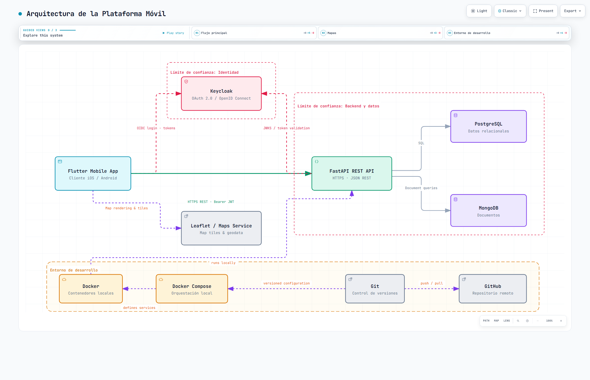

# Práctica 02 - Arquitectura de plataforma móvil

## Descripción

Esta práctica documenta la arquitectura de una aplicación móvil que usa Flutter como cliente, Keycloak para autenticación, FastAPI como API backend, PostgreSQL y MongoDB como persistencia, y servicios externos para mapas.

El objetivo es representar cómo interactúan los componentes del sistema, además de definir los límites de confianza, el flujo de autenticación y el entorno de desarrollo.

## Objetivo

- Definir la arquitectura general del sistema.
- Identificar clientes, servicios, autenticación y almacenamiento de datos.
- Mostrar el flujo principal entre la app móvil y los servicios backend.
- Representar el entorno de desarrollo local con Docker y GitHub.

## Componentes principales

| Componente | Función |
| --- | --- |
| Flutter Mobile App | Cliente móvil para iOS y Android |
| Keycloak | Autenticación mediante OIDC / OAuth 2.0 |
| FastAPI REST API | Exposición de endpoints protegidos |
| PostgreSQL | Base de datos relacional |
| MongoDB | Base de datos documental |
| Leaflet / Maps Service | Carga de mapas y geodata |
| Docker | Ejecución de contenedores locales |
| Docker Compose | Orquestación del entorno local |
| Git / GitHub | Control de versiones y repositorio remoto |

## Flujo principal

1. La aplicación móvil inicia sesión con Keycloak.
2. El cliente recibe un token de acceso.
3. La app realiza peticiones HTTPS a la API de FastAPI.
4. FastAPI valida el token con Keycloak.
5. La API consulta o modifica datos en PostgreSQL y MongoDB.
6. La app puede consumir servicios externos de mapas para mostrar información geográfica.

## Límite de confianza

La arquitectura separa claramente:

- Cliente móvil y servicios externos: fuera del entorno confiable.
- Keycloak y la API: capa de identidad y aplicación.
- PostgreSQL y MongoDB: zona protegida de datos.
- Entorno de desarrollo: Git, GitHub, Docker y Docker Compose.

## Estructura de archivos

- architecture-mobile-platform.json: definición estructural del diagrama de arquitectura.
- mobile-platform.architecture.json: versión principal del diagrama en formato JSON.
- mobile-platform-architecture.html: vista renderizada de la arquitectura.
- mobile-platform-architecture.visual-check.html: archivo de validación visual del diagrama.
- mobile-platform-architecture.visual-check.json: resultado de verificaciones visuales.
- mobile-platform-architecture.visual-check.1440x900.light.png: vista previa de 1440x900 en modo claro.
- mobile-platform-architecture.visual-check.1440x900.dark.png: vista previa de 1440x900 en modo oscuro.
- mobile-platform-architecture.visual-check.2048x1320.light.png: vista previa de 2048x1320 en modo claro.
- mobile-platform-architecture.visual-check.2048x1320.dark.png: vista previa de 2048x1320 en modo oscuro.

## Cómo interpretar el diagrama

- Las flechas sólidas representan flujo de negocio o autenticación crítica.
- Las flechas punteadas representan soporte del entorno de desarrollo o integración local.
- Los contenedores con bordes de seguridad indican límites de confianza y acceso autorizado.

Imagen del diagrama:

[Ver diagrama interactivo en GitHub Pages](https://Edwinhdzcm.github.io/Practicas_Integradora_230425/Practica%2002/mobile-platform-architecture.html)

## Resultado esperado

La práctica permite visualizar de manera clara cómo se organiza una arquitectura móvil moderna con autenticación, capas de negocio y persistencia distribuida, además de incluir el soporte necesario para desarrollo y despliegue local.

## Conclusión

La solución documentada refleja un patrón común en aplicaciones móviles actuales: cliente multiplataforma, autenticación centralizada, API segura, almacenamiento heterogéneo y herramientas de desarrollo automatizadas.
